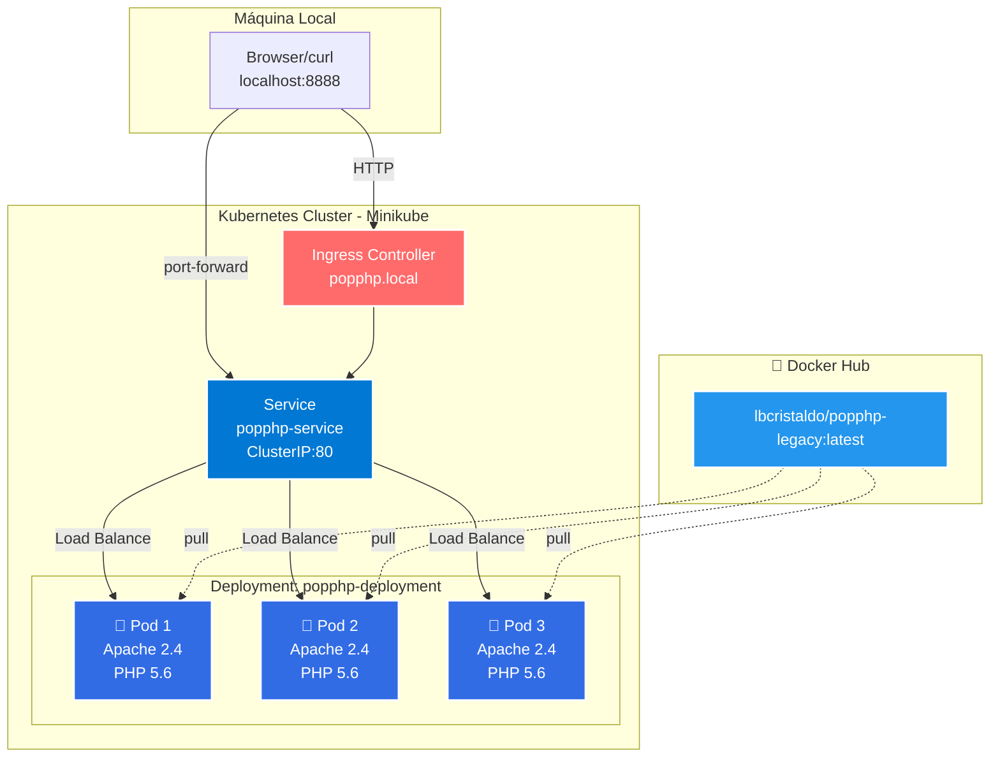
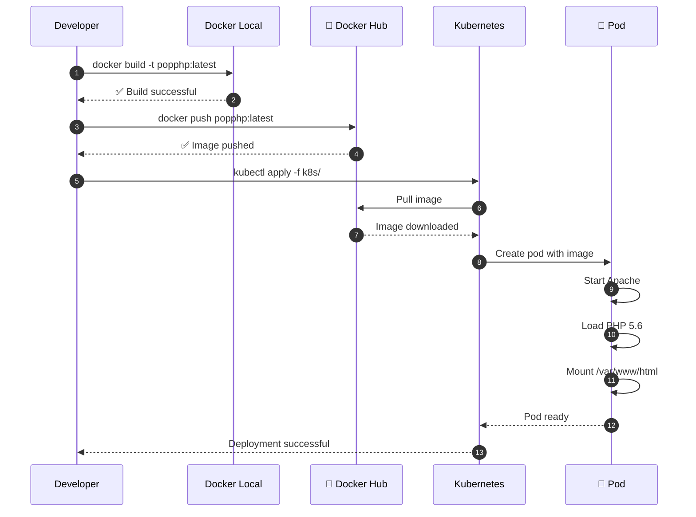
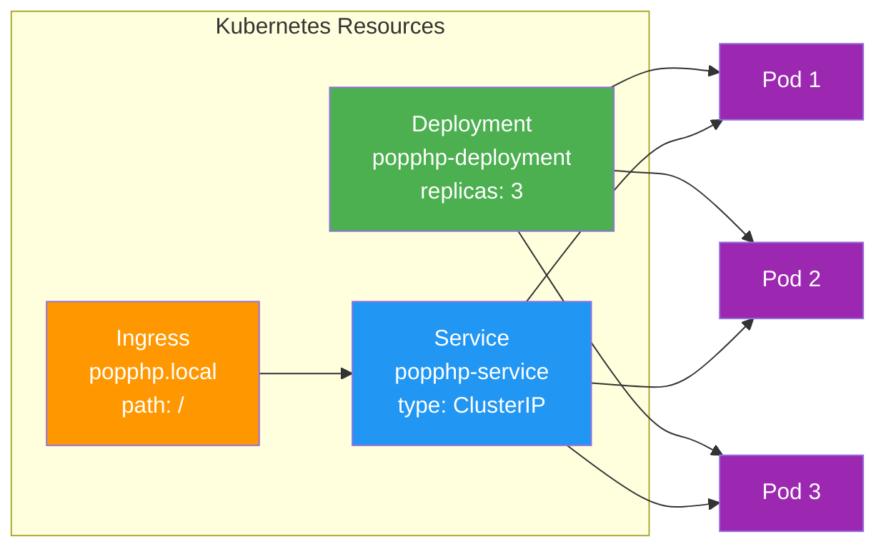
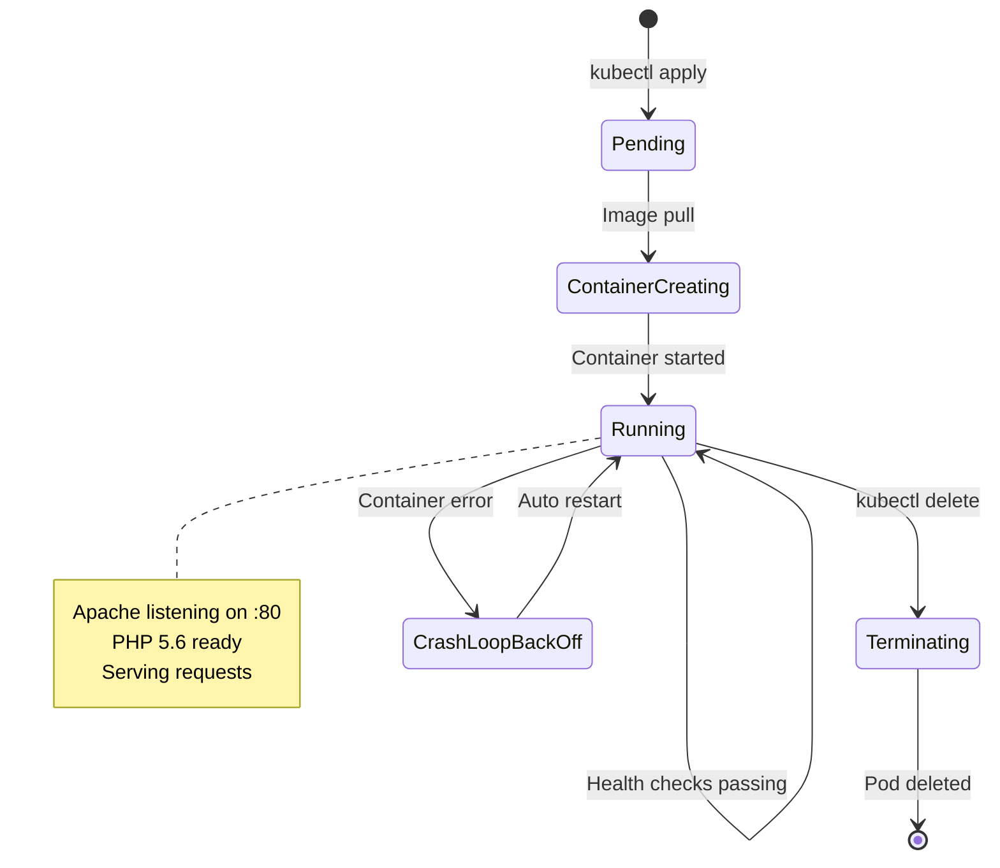

# Pop PHP Legacy - Migración a Kubernetes

[](https://github.com/lbcristaldo/popphp-kubernetes-migration/actions/workflows/build-and-deploy.yml)
[](https://github.com/lbcristaldo/popphp-kubernetes-migration/actions/workflows/trivy-scan.yml)

> **Security Notice:** Este proyecto contiene deliberadamente una stack 
> legacy (PHP 5.6) con vulnerabilidades conocidas para fines educativos. 
> Ver sección "Known Security Issues" para detalles completos.

---

 *Proyecto Original*
Framework Pop PHP v1 (legacy, 2016) migrado a contenedores y Kubernetes.

### Documentación original:
- `README-POPPHP-FRAMEWORK.md` - Documentación del framework original
- `INSTALL.md` - Instrucciones de instalación originales
- `CHANGELOG.md` - Historial de cambios del framework

## Migración a Docker/Kubernetes

  *Estado de la Migración:*

**MIGRACIÓN COMPLETA Y FUNCIONAL**

Este proyecto representa una migración exitosa de una aplicación PHP legacy (2016) a una infraestructura moderna basada en contenedores y Kubernetes. No se trata únicamente de containerización, sino de una migración funcional completa donde:

- El framework Pop PHP v1 está completamente operativo
- Todos los componentes del framework están disponibles y accesibles
- La integración con base de datos MySQL funciona usando los adaptadores nativos del framework
- Más de 30 ejemplos del framework están listos para ejecutarse
- El sistema de autoloading del framework funciona correctamente
- Apache está configurado con mod_rewrite para soportar el routing del framework

 *Funcionalidad Demostrada*

 _Interfaz Web Interactiva:_
- Página principal con catálogo de todos los ejemplos disponibles
- Sistema de navegación entre componentes del framework
- Información en tiempo real del estado del sistema
- Estadísticas de uso y distribución de carga

 _Integración con Base de Datos:_
- Uso del adaptador `Pop\Db\Db` del framework
- Demostración de queries, inserts y selects
- Persistencia de datos verificada
- Múltiples tablas funcionando simultáneamente

 _Ejemplos del Framework Disponibles:_
El proyecto incluye acceso web a los ejemplos oficiales de Pop PHP en las siguientes categorías:
- Archive, Auth, Cache, Code, Color, Config
- Crypt, Curl, Data, Db, Dom, Event, Feed
- File, Filter, Form, Ftp, Geo, Graph, Http
- Image, Log, Mail, Mvc, Nav, Paginator
- Payment, Pdf, Service, Shipping, Validator, Web

---

## Arquitectura del Sistema

 _Diagrama de Infraestructura_


 _Flujo de Deployment_


 _Componentes de Kubernetes_


 _Estados del Pod_

---

## Health Checks Configurados

El deployment incluye tres tipos de health checks para garantizar alta disponibilidad:

| Probe | Propósito | Configuración |
|-------|-----------|---------------|
| 🔵 Startup | Da tiempo de arranque (hasta 150s) | Cada 5s, max 30 fallos |
| 🟡 Readiness | ¿Listo para recibir tráfico? | Cada 10s después de 5s |
| 🟢 Liveness | ¿El contenedor está vivo? | Cada 20s después de 15s |

  _¿Qué hace cada uno?_

 **StartupProbe:** Protege pods lentos durante el arranque. Desactiva los otros probes hasta que el pod responda correctamente.

 **ReadinessProbe:** Si falla, Kubernetes elimina el pod del Service (no recibe tráfico), pero NO lo reinicia.

 **LivenessProbe:** Si falla, Kubernetes reinicia el pod automáticamente. Útil para recuperarse de deadlocks.

### Verificar estado
```bash
Ver health checks de un pod
kubectl describe pod <POD_NAME>

Ver pods que están Ready
kubectl get pods -o wide

Simular fallo y ver auto-recovery
kubectl exec -it <POD_NAME> -- pkill apache2
kubectl get pods -w  # Ver cómo Kubernetes lo reinicia
```
---

## Base de Datos MySQL

 _Configuración_
- Versión: MySQL 5.7
- Persistencia: PersistentVolumeClaim (1Gi)
- Credenciales: Kubernetes Secrets
- Service: `mysql-service` (ClusterIP interno)

 Integración con Pop PHP Framework

*La aplicación utiliza el adaptador oficial de Pop PHP para conectarse a MySQL:*
```php
use Pop\Db\Db;

$creds = array(
    'database' => 'popphp_db',
    'host'     => 'mysql-service',
    'username' => 'popphp_user',
    'password' => 'popphp_pass'
);

$db = Db::factory('Mysqli', $creds);
$db->adapter()->query('SELECT * FROM table');
```

## Tablas en Uso

framework_visits:
- Registra cada acceso a la aplicación
- Incluye hostname del pod para tracking de load balancing
- **Propósito:** Demostrar persistencia y distribución de carga

pop_examples:
- Tabla de demostración del framework
- Usada en ejemplos de queries y manipulación de datos
- Propósito: Mostrar funcionalidad del adaptador Pop\Db\Db

### Recursos desplegados
```bash
kubectl get pods -l app=mysql
kubectl get pvc
kubectl get secrets mysql-secret
```

### Verificar persistencia
```bash
 Borrar todos los pods
kubectl delete pods -l app=popphp

 Verificar que los datos persisten
kubectl port-forward service/popphp-service 8888:80
curl http://localhost:8888

 Los contadores deberían mantener sus valores
```

### Conectarse a MySQL directamente
```bash
 Port forward a MySQL
kubectl port-forward service/mysql-service 3306:3306

 En otra terminal, conectarse
mysql -h 127.0.0.1 -u popphp_user -ppopphp_pass popphp_db

 Ver las tablas
SHOW TABLES;

 Ver las visitas
SELECT * FROM framework_visits ORDER BY visited_at DESC;

 Ver ejemplos
SELECT * FROM pop_examples;
```
---

## Observabilidad y Monitoreo

_Stack de Monitoring_
- **Prometheus v2.45.0:** Recolección y almacenamiento de métricas
- **Grafana v10.0.0:** Visualización y dashboards interactivos
- **Métricas:** Sistema, aplicación, base de datos

### Componentes Desplegados
```bash
kubectl get pods -l app=prometheus
kubectl get pods -l app=grafana
kubectl get configmap | grep -E "prometheus|grafana"
```

### Dashboards Disponibles

_Pop PHP - System Overview:_
- Estado de pods PHP en tiempo real
- Estado de MySQL
- Estado de Prometheus
- Actualización automática cada 10 segundos

_Pop PHP - Application Metrics:_
- Tabla con todos los pods y su estado
- Distribución de servicios
- Health general del sistema

### Acceso a las Herramientas

**Prometheus:**
```bash
kubectl port-forward service/prometheus-service 9090:9090
```
URL: http://localhost:9090

*Funciones:*
- Explorar métricas disponibles
- Ejecutar queries PromQL
- Ver targets siendo scrapeados
- Alertas configuradas

**Grafana:**
```bash
kubectl port-forward service/grafana-service 3000:3000
```
URL: http://localhost:3000
Credenciales: admin / admin

*Funciones:*
- Dashboards pre-configurados
- Datasource Prometheus integrado
- Visualizaciones en tiempo real
- Exportación de dashboards

### Métricas Clave Disponibles

*Sistema:*
- `up{pod=~"popphp.*"}`: Estado de pods PHP
- `up{pod=~"mysql.*"}`: Estado de MySQL
- `up{pod=~"prometheus.*"}`: Estado de Prometheus
- `up{pod=~"grafana.*"}`: Estado de Grafana

*Kubernetes:*
- Pod status y health
- Service availability
- Container states

### Queries Útiles

_Contar pods corriendo:_
```promql
count(up{pod=~"popphp.*"} == 1)
```

_Ver todos los servicios:_
```promql
up{pod=~".*"}
```

_Filtrar por aplicación:_
```promql
up{pod=~"popphp.*|mysql.*"}
```

### Configuración

*Prometheus ConfigMap:*
- Scrape interval: 15 segundos
- Autodiscovery de pods con labels
- RBAC configurado para acceso al API de Kubernetes

*Grafana Provisioning:*
- Datasource Prometheus pre-configurado
- Dashboards cargados automáticamente
- No requiere configuración manual

---

## Troubleshooting Observabilidad

*Prometheus no muestra targets:*
```bash
kubectl logs -f deployment/prometheus | grep -i error
kubectl get serviceaccount prometheus
kubectl get clusterrole prometheus
```

*Grafana no carga dashboards:*
```bash
kubectl logs -f deployment/grafana | grep -i dashboard
kubectl get configmap | grep grafana
kubectl describe pod -l app=grafana
```

*Métricas no disponibles:*
```bash
curl http://localhost:9090/api/v1/targets
curl http://localhost:9090/api/v1/label/__name__/values
```

*Verificación del stack*
```bash
kubectl get pods -l 'app in (prometheus,grafana)'
kubectl get svc -l 'app in (prometheus,grafana)'
curl -s http://localhost:9090/-/healthy
curl -s http://localhost:3000/api/health
```
---

## CI/CD Pipeline

- GitHub Actions

El proyecto incluye pipeline automatizado de integración y despliegue continuo.

**Workflow:** `.github/workflows/build-and-deploy.yml`

### Pipeline Stages

_Build:_
- Checkout del código
- Setup de Docker Buildx
- Login a Docker Hub
- Extracción de versión desde commit SHA
- Build de imagen con cache layers
- Push a Docker Hub con tags:
  - `latest` (última versión estable)
  - `<commit-sha>` (versión específica para rollback)

_Deploy:_
- Se ejecuta solo en rama `main`
- Genera resumen del deployment
- Prepara metadata para ArgoCD sync

_Triggers_
- Push a rama `main`: Build + Deploy automático
- Pull Request: Solo build (testing)

### Secrets Configurados

*Secrets requeridos en GitHub Actions:*
- `DOCKER_USERNAME`: Usuario de Docker Hub
- `DOCKER_PASSWORD`: Password o token de Docker Hub

 **Verificar Pipeline**

Ver est1ado del pipeline:
```bash
https://github.com/lbcristaldo/popphp-kubernetes-migration/actions
```

Badge de estado visible en el README principal.

 **Ventajas del Pipeline**

- Build automático en cada push
- Versionado automático por commit
- Cache de layers para builds más rápidos
- No requiere build manual local
- Preparado para integración con ArgoCD

---

## GitOps con ArgoCD

Deployment Declarativo Automatizado

ArgoCD implementa GitOps: Git es la única fuente de verdad para el estado del cluster.

Flujo completo end-to-end:
```
Código → Git push → GitHub Actions (build) → Docker Hub → ArgoCD (sync) → Kubernetes
```

 _Instalación_
```bash
kubectl create namespace argocd
kubectl apply -n argocd -f https://raw.githubusercontent.com/argoproj/argo-cd/stable/manifests/install.yaml
```

 _Acceso a ArgoCD_

→ Obtener password inicial:
```bash
kubectl -n argocd get secret argocd-initial-admin-secret -o jsonpath="{.data.password}" | base64 -d
```

 Port forward:
```bash
kubectl port-forward svc/argocd-server -n argocd 8080:443
```

- URL: https://localhost:8080
- Usuario: admin
- Password: [output del comando anterior]

### Application Configuration

Archivo: `argocd/application.yaml`

*Configuración:*
- Repository: https://github.com/lbcristaldo/popphp-kubernetes-migration.git
- Path: k8s/
- Target Revision: main
- Destination: default namespace
- Sync Policy: Automático

*Políticas activas:*
- Auto-sync: Aplica cambios detectados en Git automáticamente
- Self-heal: Revierte cambios manuales no declarados en Git
- Prune: Elimina recursos borrados del repositorio

*Aplicar Application*
```bash
kubectl apply -f argocd/application.yaml

kubectl get application -n argocd
```

 **Verificar Estado**

*Via kubectl:*
```bash
kubectl get application -n argocd popphp-legacy
kubectl describe application -n argocd popphp-legacy
```

*Via UI:*
- Acceder a https://localhost:8080
- Ver el grafo de recursos
- Estado de sync (Synced/OutOfSync)
- Health status de cada componente

 **Flujo de Trabajo GitOps**

_Para hacer cambios:_
1. Editar manifiestos en `k8s/`
2. Commit y push a GitHub
3. ArgoCD detecta el cambio (polling cada 3 minutos)
4. Sync automático aplica los cambios
5. Verificar en la UI que el sync fue exitoso

*Ejemplo - Escalar replicas:*
```bash
nano k8s/deployment.yaml
git add k8s/deployment.yaml
git commit -m "scale: Increase replicas to 5"
git push

ArgoCD sincronizará automáticamente en ~3 minutos
```

 **Rollback**

*Opción 1: Git revert*
```bash
git revert HEAD
git push

ArgoCD aplicará el estado anterior automáticamente
```

*Opción 2: Via UI*
- Ir a History en la aplicación
- Seleccionar versión anterior
- Click en "Sync to this version"

### Ventajas de GitOps
- **Auditoría completa:** Cada cambio registrado en Git
- **Declarativo:** Estado deseado siempre en código
- **Disaster recovery:** Recrear cluster desde Git
- **No kubectl manual:** Git es la única interfaz
- **Self-healing:** Estado real converge al deseado
- **Multi-cluster:** Gestionar múltiples clusters desde un repo
- **Seguridad:** No requiere exponer API de Kubernetes

 *_Diferencia con CI/CD tradicional_*
- CI/CD tradicional (push-based):
```
Pipeline → kubectl apply → Kubernetes
```
**Problemas:** Requiere credenciales, no detecta drift, no self-healing

- GitOps con ArgoCD (pull-based):
```
Git (source of truth) ← ArgoCD (monitorea) → Kubernetes (reconcilia)
```
**Ventajas:** Seguro, declarativo, auditable, self-healing

 _Monitoreo de Sync_
```bash
kubectl get application -n argocd -w

kubectl logs -n argocd -l app.kubernetes.io/name=argocd-application-controller
```
---

### Troubleshooting ArgoCD

**Application OutOfSync:**
- Verificar que el path en Git sea correcto
- Revisar logs: `kubectl logs -n argocd -l app.kubernetes.io/name=argocd-repo-server`
- Forzar refresh: En UI → Refresh

**Sync failed?:**
- Ver detalles del error en la UI
- Verificar que los manifiestos sean válidos: `kubectl apply --dry-run=client -f k8s/`
- Revisar permisos del ServiceAccount de ArgoCD

**Self-heal no funciona?:**
- Verificar que esté habilitado en syncPolicy
- Cambios manuales se revierten en el próximo sync (max 3 min)

---

## Security Scanning con Trivy

### Análisis de Vulnerabilidades Automatizado

El proyecto implementa escaneo de seguridad continuo con Trivy en múltiples capas.

[](https://github.com/lbcristaldo/popphp-kubernetes-migration/actions/workflows/trivy-scan.yml)

### Tipos de Escaneo

**1. Vulnerability Scan (Imágenes Docker)**
- Escanea la imagen antes de cada deployment
- Detecta CVEs en dependencias del sistema
- Severity: CRITICAL, HIGH, MEDIUM
- Bloquea push si hay vulnerabilidades críticas

**2. Configuration Scan (Manifiestos K8s)**
- Valida configuraciones de Kubernetes
- Detecta misconfigurations de seguridad
- Escanea archivos en `k8s/`
- Verifica best practices

**3. Secret Scan (Código fuente)**
- Detecta credenciales expuestas
- API keys, passwords, tokens
- Escanea todo el repositorio
- Falla el build si encuentra secrets

### Pipeline de Seguridad
```
Push/PR → Build imagen → Trivy scan → Upload a Security tab → Block si crítico
```

### Ejecutar Localmente

**Scan de imagen:**
```bash
docker build -t popphp-legacy:test .
trivy image popphp-legacy:test
```

**Scan de configuración:**
```bash
trivy config k8s/
```

**Scan de secrets:**
```bash
trivy fs --scanners secret .
```

### Instalación de Trivy (local)
```bash
# Linux
wget -qO - https://aquasecurity.github.io/trivy-repo/deb/public.key | sudo apt-key add -
echo "deb https://aquasecurity.github.io/trivy-repo/deb $(lsb_release -sc) main" | sudo tee /etc/apt/sources.list.d/trivy.list
sudo apt update
sudo apt install trivy

# macOS
brew install trivy

# Verificar instalación
trivy --version
```

### Resultados de Scan

**GitHub Security Tab:**
- Ir a: Security → Code scanning alerts
- Ver vulnerabilidades detectadas
- Detalles de CVE y remediación
- Timeline de detección

**En el workflow:**
- Ver output en Actions
- Tabla de vulnerabilidades
- Severity y paquetes afectados

### Políticas de Seguridad

**Bloquean el build:**
- Secrets expuestos en código
- CVEs CRITICAL en imagen (opcional)

**No bloquean pero alertan:**
- CVEs HIGH/MEDIUM
- Misconfigurations en K8s
- Dockerfile best practices

### Frecuencia de Escaneo

- **On push/PR:** Scan completo automático
- **Scheduled:** Domingos a medianoche (cron)
- **Manual:** Puede ejecutarse on-demand

### Vulnerabilidades Comunes Detectadas

**En imágenes base:**
- Paquetes desactualizados del sistema
- Libraries con CVEs conocidos
- Dependencies transitivas vulnerables

**En configuraciones:**
- Containers running as root
- Missing resource limits
- Privileged containers
- Exposed secrets in manifests

**En código:**
- API keys hardcoded
- Database passwords en código
- AWS credentials expuestas

### Remediación

**Para vulnerabilidades de imagen:**
```bash
# Actualizar imagen base
FROM php:5.6-apache  # Vulnerable
FROM php:8.2-apache  # Actualizada

# O aplicar patches
RUN apt-get update && apt-get upgrade -y
```

**Para misconfigurations:**
```yaml
# Antes
spec:
  containers:
  - name: app
    image: myapp

# Después
spec:
  containers:
  - name: app
    image: myapp
    securityContext:
      runAsNonRoot: true
      readOnlyRootFilesystem: true
    resources:
      limits:
        cpu: 500m
        memory: 512Mi
```

---

### Optimizaciones de Performance

**Cache de base de datos:**
- La DB de vulnerabilidades se cachea entre ejecuciones
- Reduce tiempo de scan de ~2min a ~30seg
- Cache invalidada diariamente

**Detection priority:**
- Modo `precise` (default) evita falsos positivos
- Balance entre velocidad y precisión
- Reduce noise en alertas

**Escaneo combinado:**
- Vulnerabilidades + Misconfigurations en un paso
- Detecta problemas en la configuración interna del contenedor
- Variables de entorno inseguras, permisos incorrectos

---

### Integración con CI/CD

El scan de Trivy se ejecuta:
1. Antes del push a Docker Hub
2. En paralelo con tests
3. Resultados en GitHub Security
4. Notificaciones si hay issues críticos

### Métricas de Seguridad

Ver en GitHub Security:
- Total de vulnerabilidades
- Por severity (Critical/High/Medium/Low)
- Tendencia temporal
- Tiempo de remediación

---

## Known Security Issues - Legacy Stack

### CRITICAL Security Disclosure

Este proyecto utiliza PHP 5.6 con Apache 2.4 sobre una base system image 
desactualizada. El escaneo de seguridad identificó:

**Resultados de Trivy Scan:**
- **1,157 vulnerabilidades CRITICAL**
- Categorías principales:
  - Buffer overflows en kernel Linux
  - Memory corruption en glibc/libssl
  - Out-of-bounds reads en libxml2, libssh2, libcurl
  - SQL injection vectors en OpenLDAP
  - Integer overflows en múltiples libraries

### Contexto del Proyecto

**Este es un proyecto de infraestructura, no de modernización de código.**

El objetivo fue demostrar:
1. Containerización de aplicaciones legacy "as-is"
2. Orquestación con Kubernetes
3. Observabilidad con Prometheus/Grafana
4. CI/CD con GitHub Actions
5. GitOps con ArgoCD
6. **Identificación y documentación de deuda técnica de seguridad**

### Qué pasó con PHP 5.6?

**PHP 5.6:**
- End of Life: Enero 2018 (hace 7 años)
- Sin parches de seguridad desde entonces
- CVEs acumulados sin remediación disponible

**Decisión técnica:**
Mantener PHP 5.6 para demostrar el escenario real de muchas organizaciones:
aplicaciones legacy en producción con deuda técnica significativa que requieren
migración de infraestructura ANTES de modernización de código.

### Estrategia de Remediación en Producción

En un entorno de producción real, la estrategia sería:

**Fase 1: Mitigación inmediata (0-3 meses)**
```yaml
- Implementar WAF (Web Application Firewall)
- Network policies estrictas en Kubernetes
- Segmentación de red
- Rate limiting
- Monitoreo de anomalías con Falco/SIEM
```

**Fase 2: Actualización técnica (3-6 meses)**
```yaml
- Migrar a PHP 8.2+ (requiere refactoring)
- Actualizar todas las dependencias del sistema
- Implementar security hardening en containers
- Non-root containers
- Read-only filesystem donde sea posible
```

**Fase 3: Reescritura (6-18 meses)**
```yaml
- Evaluar reescritura en stack moderno
- Microservicios vs monolito
- Considera costos vs beneficios
```

### Valor del Security Scanning

La implementación de Trivy demuestra:

**DevSecOps en acción:**
- Visibilidad completa de superficie de ataque
- Documentación de riesgos para stakeholders
- Priorización basada en severity
- Auditoría y compliance
- Shift-left security (detección temprana)

**Decisiones informadas:**
> "No podemos arreglar lo que no medimos. Estas 1,157 vulnerabilidades 
> justifican inversión en modernización y priorizan el trabajo de seguridad."

### Análisis de Vulnerabilidades Principales

**Categorías de mayor riesgo:**

1. **Kernel Linux** (300+ CVEs)
   - Buffer overflows en drivers de red
   - Out-of-bounds access en filesystems
   - Requiere: Actualizar base image

2. **glibc/libssl** (200+ CVEs)
   - Memory corruption vulnerabilities
   - TLS/SSL weaknesses
   - Requiere: Rebuild con libraries actualizadas

3. **XML/HTTP libraries** (150+ CVEs)
   - libxml2: XXE injection vectors
   - libcurl: Request smuggling
   - Requiere: Upgrade de dependencias

4. **System utilities** (500+ CVEs)
   - shadow-utils, openssh, openldap
   - Requiere: System package updates

### Lecciones para Equipos de Ingeniería

**Este proyecto demuestra:**

1. **La deuda técnica tiene costo de seguridad medible**
   - 1,157 vulnerabilidades = superficie de ataque cuantificada

2. **Legacy no significa inseguro SOLO SI se gestiona correctamente**
   - Segmentación de red
   - Defense in depth
   - Monitoring activo

3. **La visibilidad es el primer paso**
   - Trivy scan = baseline de seguridad
   - Tracking de mejoras en el tiempo

4. **Trade-offs técnicos deben ser documentados**
   - Decisión consciente de mantener PHP 5.6
   - Riesgos conocidos y mitigados
   - Plan de remediación definido

### Acceso a Resultados Completos

**GitHub Security Tab:**
```
https://github.com/lbcristaldo/popphp-kubernetes-migration/security/code-scanning
```

**Filtros útiles:**
- Severity: CRITICAL
- Tool: Trivy
- State: Open

Cada vulnerabilidad incluye:
- CVE ID y descripción
- Severity score (CVSS)
- Affected package y versión
- Fixed version (si existe)
- Referencias a parches

### Disclaimer

Dado el carácter educativo y demostrativo de este proyecto, es imprescindible mencionar que NO debe desplegarse en producción
sin implementar las mitigaciones de seguridad recomendadas. La exposición de
vulnerabilidades conocidas es intencional para fines pedagógicos en este entorno.

---

### Estructura del proyecto
```
popphp-v1-legacy/
├── Dockerfile              # ← NUEVO: Imagen Docker
├── docker-compose.yml      # ← NUEVO: Compose (opcional)
├── .dockerignore          # ← NUEVO: Exclusiones de build
├── k8s/                   # ← NUEVO: Manifiestos Kubernetes
│   ├── deployment.yaml
│   ├── service.yaml
│   └── ingress.yaml
├── index.php              # Punto de entrada de la app
├── public/                # Assets del framework
├── vendor/                # Framework Pop PHP
└── script/                # Scripts CLI del framework
```
---

### Guía de Despliegue

**Pre-requisitos**
- Docker instalado
- Minikube instalado
- kubectl configurado

1. Build de la imagen
```bash
docker build -t lbcristaldo/popphp-legacy:latest .
```

2. Test local
```bash
docker run --rm -p 8080:80 lbcristaldo/popphp-legacy:latest
curl http://localhost:8080
```

3. Push a Docker Hub
```bash
docker push lbcristaldo/popphp-legacy:latest
```

4. Deploy en Kubernetes
```bash
 Iniciar Minikube
minikube start
minikube addons enable ingress

 Aplicar manifiestos
kubectl apply -f k8s/deployment.yaml
kubectl apply -f k8s/service.yaml
kubectl apply -f k8s/ingress.yaml

 - Verificar
kubectl get pods
kubectl get services
```

5. Acceder a la aplicación

Opción A: Port Forward
```bash
kubectl port-forward service/popphp-service 8888:80
 - Abrir: http://localhost:8888
```

Opción B: Ingress
```bash
 - Agregar a /etc/hosts
echo "$(minikube ip) popphp.local" | sudo tee -a /etc/hosts
 - Abrir: http://popphp.local
```
---

### Verificación de la Migración

 **Pruebas Funcionales**

1. Verificar que el framework carga correctamente:
```bash
curl http://localhost:8888 | grep "Pop PHP Framework"
```

 Deberías ver el título principal de la aplicación.

2. Verificar conexión a MySQL:
```bash
curl -s http://localhost:8888 | grep "MySQL conectado"
```

 Debe mostrar mensaje de conexión exitosa.

3. Probar el adaptador de base de datos del framework:
```bash
curl http://localhost:8888/db-demo.php
```

 Debe mostrar una tabla con datos insertados usando Pop\Db\Db.

4. Verificar que los ejemplos son accesibles:
```bash
curl -s http://localhost:8888 | grep -o "ejemplo(s)" | wc -l
```

 Debe mostrar aproximadamente 30 (un contador por cada categoría de ejemplos).

5. Probar persistencia de datos:
```bash
 Primera visita - anotar el número
curl -s http://localhost:8888 | grep "Total de visitas"

 Segunda visita - debe incrementarse
curl -s http://localhost:8888 | grep "Total de visitas"
```

6. Verificar load balancing entre pods:
```bash
 Hacer múltiples requests y ver diferentes hostnames
for i in {1..10}; do 
  curl -s http://localhost:8888 | grep "Hostname:"
done
```

 Deberías ver diferentes nombres de pods si hay múltiples replicas.

### Endpoints Disponibles

| URL | Descripción | Propósito |
|-----|-------------|-----------|
| `/` | Página principal | Índice de ejemplos y estado del sistema |
| `/db-demo.php` | Demo de integración DB | Muestra Pop\Db\Db en acción |
| `/public/examples/[categoria]/` | Ejemplos del framework | Acceso a ejemplos originales de Pop PHP |
| `/public/bootstrap.php` | Autoloader | Punto de entrada del framework |

---

### Métricas de Éxito

La migración se considera exitosa si:
- El autoloader de Pop PHP carga sin errores
- La conexión a MySQL funciona usando Pop\Db\Db
- Los ejemplos del framework son accesibles vía web
- Los datos persisten al reiniciar pods
- El load balancing distribuye requests entre replicas
- Los health checks reportan estado saludable
- Apache responde con mod_rewrite habilitado

---

### Troubleshooting

**Problemas Comunes**

### ꩜ .ᐟProblema: "could not find driver" al conectar a MySQL

 **Causa:** Faltan extensiones PHP de MySQL.
 **Solución:**
```bash
 Verificar que el Dockerfile incluye:
RUN docker-php-ext-install pdo pdo_mysql mysqli

 Rebuild
docker build -t lbcristaldo/popphp-legacy:v5 .
docker push lbcristaldo/popphp-legacy:v5
kubectl set image deployment/popphp-legacy web=lbcristaldo/popphp-legacy:v5
```

### ꩜ .ᐟProblema: Ejemplos del framework dan error 404

 **Causa:** mod_rewrite no está habilitado o AllowOverride no está configurado.
 **Solución:**
```bash
 Verificar configuración de Apache dentro del contenedor
kubectl exec -it <POD_NAME> -- bash
apache2ctl -M | grep rewrite  # Debe mostrar rewrite_module
cat /etc/apache2/apache2.conf | grep AllowOverride  # Debe ser "All"
```

### ꩜ .ᐟProblema: MySQL connection refused

**Causa:** El service de MySQL no está corriendo o el nombre es incorrecto.
**Solución:**
```bash
 Verificar que MySQL está corriendo
kubectl get pods -l app=mysql

 Verificar que el service existe
kubectl get svc mysql-service

 Verificar conectividad desde un pod de PHP
kubectl exec -it <PHP_POD> -- ping mysql-service
```

### ꩜ .ᐟProblema: Los datos no persisten al reiniciar

**Causa:** PersistentVolumeClaim no está montado correctamente.
**Solución:**
```bash
 Verificar que el PVC existe y está bound
kubectl get pvc

  Verificar que está montado en el pod de MySQL
kubectl describe pod <MYSQL_POD> | grep -A 5 "Mounts:"
```

### Comandos de Diagnóstico

**Ver logs en tiempo real:**
```bash
 Logs de PHP
kubectl logs -f deployment/popphp-legacy

 Logs de MySQL
kubectl logs -f deployment/mysql-deployment
```

**Entrar al contenedor:**
```bash
 PHP
POD=$(kubectl get pods -l app=popphp -o jsonpath='{.items[0].metadata.name}')
kubectl exec -it $POD -- bash

 MySQL
POD=$(kubectl get pods -l app=mysql -o jsonpath='{.items[0].metadata.name}')
kubectl exec -it $POD -- bash
```

**Verificar configuración:**
```bash
 Ver deployment completo
kubectl get deployment popphp-legacy -o yaml

 Ver secrets
kubectl get secret mysql-secret -o yaml

 Ver PVC status
kubectl describe pvc mysql-pvc
```

**Rebuild y redeploy completo:**
```bash
 Rebuild imagen
docker build -t lbcristaldo/popphp-legacy:latest .
docker push lbcristaldo/popphp-legacy:latest

 Forzar pull de nueva imagen
kubectl set image deployment/popphp-legacy web=lbcristaldo/popphp-legacy:latest
kubectl rollout restart deployment/popphp-legacy

 Ver progreso
kubectl rollout status deployment/popphp-legacy
kubectl get pods -w
```
---

### ✮⋆Stack Tecnológico
- Framework: Pop PHP v1 (2016)
- Runtime: PHP 5.6 + Apache 2.4
- Containerización: Docker
- Orquestación: Kubernetes (Minikube)
- Registry: Docker Hub

Autor de la migración
Luciana Cristaldo - Noviembre 2025

Licencias
- Framework Pop PHP: Ver `LICENSE.txt`
- Migración a K8s: Proyecto académico
```
