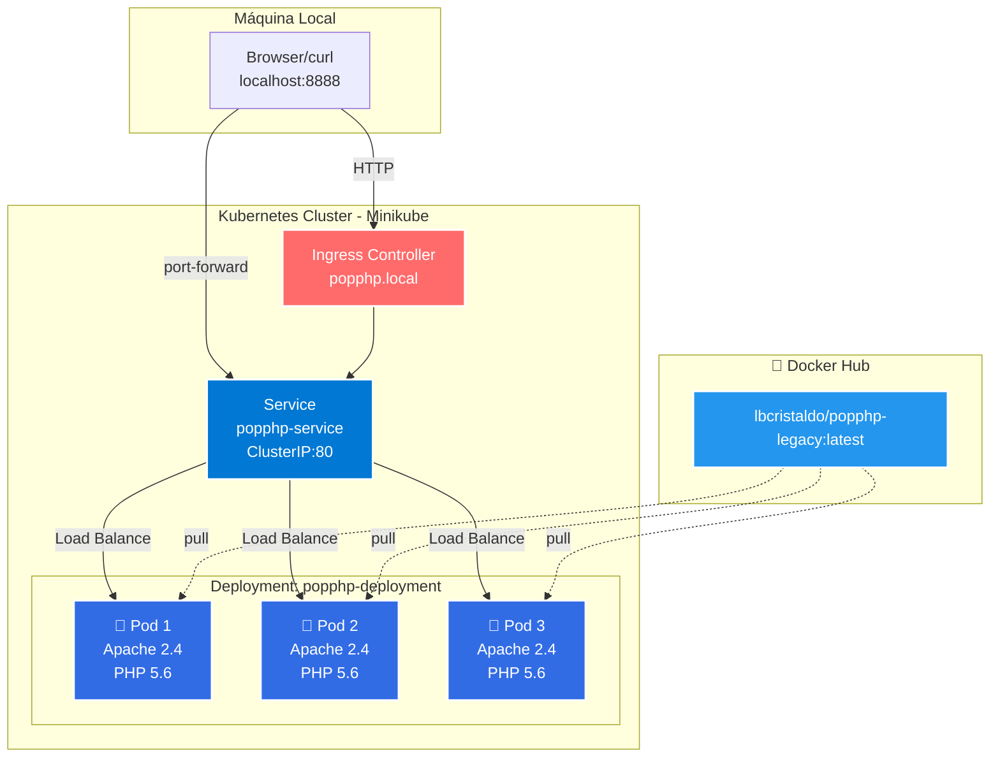
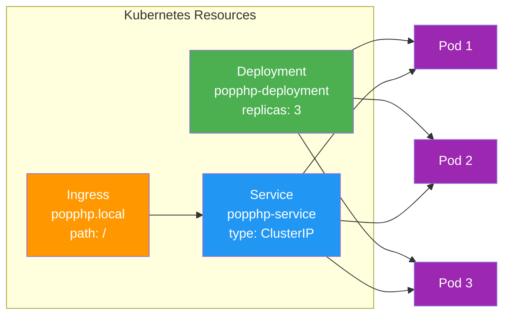
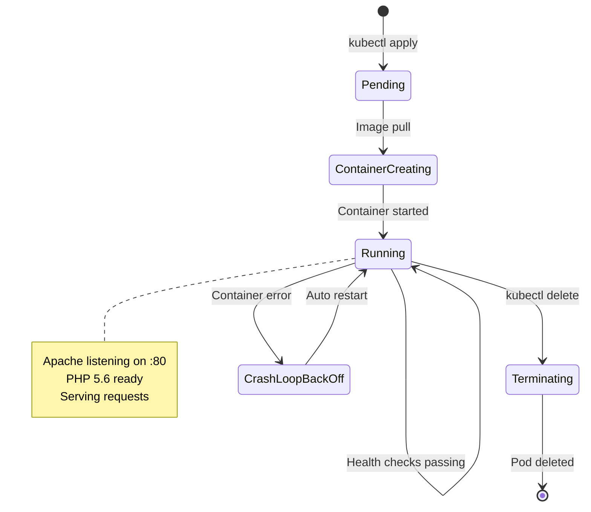

cat > README-KUBERNETES.md << 'EOF'
Pop PHP Legacy - Migración a Kubernetes

 Proyecto Original
Este es el framework Pop PHP v1 (legacy, 2016) migrado a contenedores y Kubernetes.

Documentación original:
- `README.md` - Documentación del framework original
- `INSTALL.md` - Instrucciones de instalación originales
- `CHANGELOG.md` - Historial de cambios del framework

 Migración a Docker/Kubernetes
 
 Arquitectura del Sistema

 Diagrama de Infraestructura


 Flujo de Deployment


 Componentes de Kubernetes


 Estados del Pod

Estructura del proyecto
```
popphp-v1-legacy/
├── Dockerfile              # ← NUEVO: Imagen Docker
├── docker-compose.yml      # ← NUEVO: Compose (opcional)
├── .dockerignore          # ← NUEVO: Exclusiones de build
├── k8s/                   # ← NUEVO: Manifiestos Kubernetes
│   ├── deployment.yaml
│   ├── service.yaml
│   └── ingress.yaml
├── index.php              # Punto de entrada de la app
├── public/                # Assets del framework
├── vendor/                # Framework Pop PHP
└── script/                # Scripts CLI del framework
```

Guía de Despliegue

 Pre-requisitos
- Docker instalado
- Minikube instalado
- kubectl configurado

1. Build de la imagen
```bash
docker build -t lbcristaldo/popphp-legacy:latest .
```

2. Test local
```bash
docker run --rm -p 8080:80 lbcristaldo/popphp-legacy:latest
curl http://localhost:8080
```

3. Push a Docker Hub
```bash
docker push lbcristaldo/popphp-legacy:latest
```

4. Deploy en Kubernetes
```bash
 Iniciar Minikube
minikube start
minikube addons enable ingress

 Aplicar manifiestos
kubectl apply -f k8s/deployment.yaml
kubectl apply -f k8s/service.yaml
kubectl apply -f k8s/ingress.yaml

 - Verificar
kubectl get pods
kubectl get services
```

5. Acceder a la aplicación

Opción A: Port Forward
```bash
kubectl port-forward service/popphp-service 8888:80
 - Abrir: http://localhost:8888
```

Opción B: Ingress
```bash
 - Agregar a /etc/hosts
echo "$(minikube ip) popphp.local" | sudo tee -a /etc/hosts
 - Abrir: http://popphp.local
```

Troubleshooting

Ver logs del pod
```bash
kubectl logs -f deployment/popphp-deployment
```

Entrar al contenedor
```bash
POD=$(kubectl get pods -l app=popphp -o jsonpath='{.items[0].metadata.name}')
kubectl exec -it $POD -- bash
```

Rebuild y redeploy
```bash
docker build -t lbcristaldo/popphp-legacy:latest .
docker push lbcristaldo/popphp-legacy:latest
kubectl rollout restart deployment/popphp-deployment
```

Stack Tecnológico
- Framework: Pop PHP v1 (2016)
- Runtime: PHP 5.6 + Apache 2.4
- Containerización: Docker
- Orquestación: Kubernetes (Minikube)
- Registry: Docker Hub

Autor de la migración
Luciana Cristaldo - Noviembre 2025

Licencias
- Framework Pop PHP: Ver `LICENSE.txt`
- Migración a K8s: Proyecto académico
EOF
```
