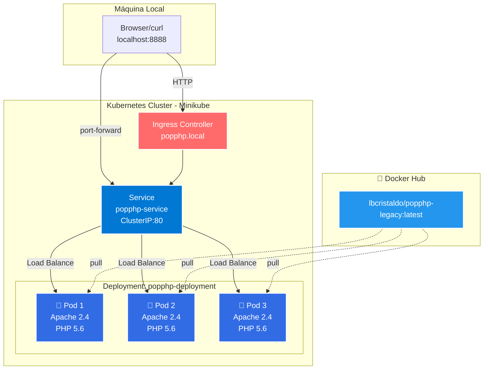
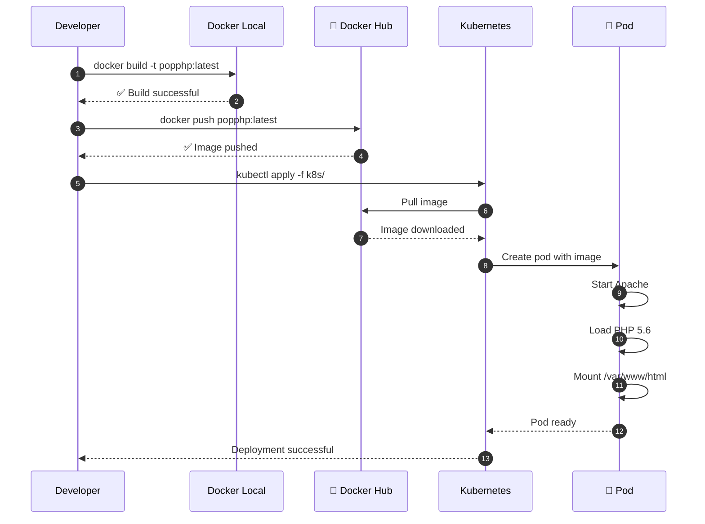
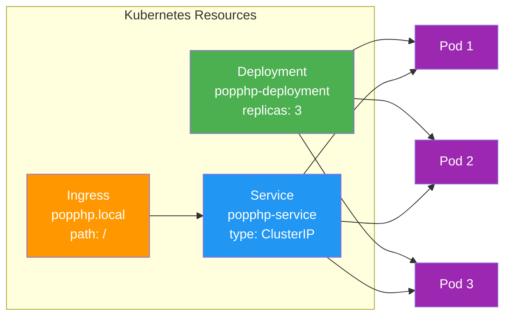
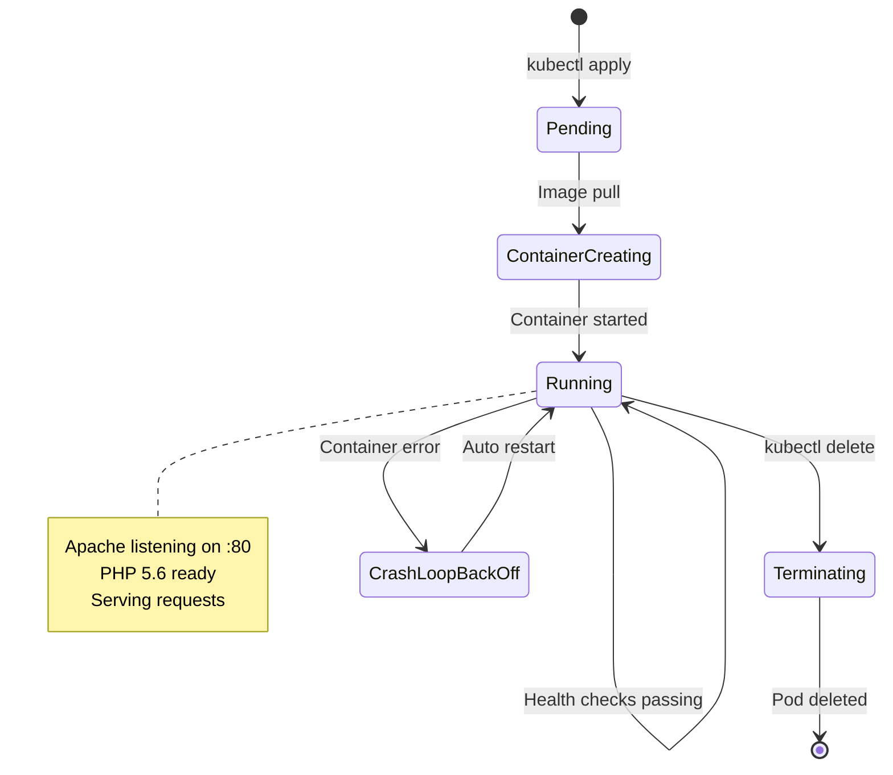

Pop PHP Legacy - Migración a Kubernetes

 Proyecto Original
Framework Pop PHP v1 (legacy, 2016) migrado a contenedores y Kubernetes.

Documentación original:
- `README-POPPHP-FRAMEWORK.md` - Documentación del framework original
- `INSTALL.md` - Instrucciones de instalación originales
- `CHANGELOG.md` - Historial de cambios del framework

 Migración a Docker/Kubernetes

  Estado de la Migración

 MIGRACIÓN COMPLETA Y FUNCIONAL

Este proyecto representa una migración exitosa de una aplicación PHP legacy (2016) a una infraestructura moderna basada en contenedores y Kubernetes. No se trata únicamente de containerización, sino de una migración funcional completa donde:

- El framework Pop PHP v1 está completamente operativo
- Todos los componentes del framework están disponibles y accesibles
- La integración con base de datos MySQL funciona usando los adaptadores nativos del framework
- Más de 30 ejemplos del framework están listos para ejecutarse
- El sistema de autoloading del framework funciona correctamente
- Apache está configurado con mod_rewrite para soportar el routing del framework

 Funcionalidad Demostrada

 Interfaz Web Interactiva:
- Página principal con catálogo de todos los ejemplos disponibles
- Sistema de navegación entre componentes del framework
- Información en tiempo real del estado del sistema
- Estadísticas de uso y distribución de carga

 Integración con Base de Datos:
- Uso del adaptador `Pop\Db\Db` del framework
- Demostración de queries, inserts y selects
- Persistencia de datos verificada
- Múltiples tablas funcionando simultáneamente

 Ejemplos del Framework Disponibles:
El proyecto incluye acceso web a los ejemplos oficiales de Pop PHP en las siguientes categorías:
- Archive, Auth, Cache, Code, Color, Config
- Crypt, Curl, Data, Db, Dom, Event, Feed
- File, Filter, Form, Ftp, Geo, Graph, Http
- Image, Log, Mail, Mvc, Nav, Paginator
- Payment, Pdf, Service, Shipping, Validator, Web


 Arquitectura del Sistema

 Diagrama de Infraestructura


 Flujo de Deployment


 Componentes de Kubernetes


 Estados del Pod

  Health Checks Configurados

El deployment incluye tres tipos de health checks para garantizar alta disponibilidad:

| Probe | Propósito | Configuración |
|-------|-----------|---------------|
| 🔵 Startup | Da tiempo de arranque (hasta 150s) | Cada 5s, max 30 fallos |
| 🟡 Readiness | ¿Listo para recibir tráfico? | Cada 10s después de 5s |
| 🟢 Liveness | ¿El contenedor está vivo? | Cada 20s después de 15s |

  ¿Qué hace cada uno?

 StartupProbe: Protege pods lentos durante el arranque. Desactiva los otros probes hasta que el pod responda correctamente.

 ReadinessProbe: Si falla, Kubernetes elimina el pod del Service (no recibe tráfico), pero NO lo reinicia.

 LivenessProbe: Si falla, Kubernetes reinicia el pod automáticamente. Útil para recuperarse de deadlocks.

 Verificar estado
```bash
Ver health checks de un pod
kubectl describe pod <POD_NAME>

Ver pods que están Ready
kubectl get pods -o wide

Simular fallo y ver auto-recovery
kubectl exec -it <POD_NAME> -- pkill apache2
kubectl get pods -w  # Ver cómo Kubernetes lo reinicia
```
\
 Base de Datos MySQL

 Configuración
- Versión: MySQL 5.7
- Persistencia: PersistentVolumeClaim (1Gi)
- Credenciales: Kubernetes Secrets
- Service: `mysql-service` (ClusterIP interno)

 Integración con Pop PHP Framework

La aplicación utiliza el adaptador oficial de Pop PHP para conectarse a MySQL:
```php
use Pop\Db\Db;

$creds = array(
    'database' => 'popphp_db',
    'host'     => 'mysql-service',
    'username' => 'popphp_user',
    'password' => 'popphp_pass'
);

$db = Db::factory('Mysqli', $creds);
$db->adapter()->query('SELECT * FROM table');
```

 Tablas en Uso

framework_visits:
- Registra cada acceso a la aplicación
- Incluye hostname del pod para tracking de load balancing
- Propósito: Demostrar persistencia y distribución de carga

pop_examples:
- Tabla de demostración del framework
- Usada en ejemplos de queries y manipulación de datos
- Propósito: Mostrar funcionalidad del adaptador Pop\Db\Db

 Recursos desplegados
```bash
kubectl get pods -l app=mysql
kubectl get pvc
kubectl get secrets mysql-secret
```

 Verificar persistencia
```bash
 Borrar todos los pods
kubectl delete pods -l app=popphp

 Verificar que los datos persisten
kubectl port-forward service/popphp-service 8888:80
curl http://localhost:8888

 Los contadores deberían mantener sus valores
```

 Conectarse a MySQL directamente
```bash
 Port forward a MySQL
kubectl port-forward service/mysql-service 3306:3306

 En otra terminal, conectarse
mysql -h 127.0.0.1 -u popphp_user -ppopphp_pass popphp_db

 Ver las tablas
SHOW TABLES;

 Ver las visitas
SELECT * FROM framework_visits ORDER BY visited_at DESC;

 Ver ejemplos
SELECT * FROM pop_examples;
```
Estructura del proyecto
```
popphp-v1-legacy/
├── Dockerfile              # ← NUEVO: Imagen Docker
├── docker-compose.yml      # ← NUEVO: Compose (opcional)
├── .dockerignore          # ← NUEVO: Exclusiones de build
├── k8s/                   # ← NUEVO: Manifiestos Kubernetes
│   ├── deployment.yaml
│   ├── service.yaml
│   └── ingress.yaml
├── index.php              # Punto de entrada de la app
├── public/                # Assets del framework
├── vendor/                # Framework Pop PHP
└── script/                # Scripts CLI del framework
```

Guía de Despliegue

 Pre-requisitos
- Docker instalado
- Minikube instalado
- kubectl configurado

1. Build de la imagen
```bash
docker build -t lbcristaldo/popphp-legacy:latest .
```

2. Test local
```bash
docker run --rm -p 8080:80 lbcristaldo/popphp-legacy:latest
curl http://localhost:8080
```

3. Push a Docker Hub
```bash
docker push lbcristaldo/popphp-legacy:latest
```

4. Deploy en Kubernetes
```bash
 Iniciar Minikube
minikube start
minikube addons enable ingress

 Aplicar manifiestos
kubectl apply -f k8s/deployment.yaml
kubectl apply -f k8s/service.yaml
kubectl apply -f k8s/ingress.yaml

 - Verificar
kubectl get pods
kubectl get services
```

5. Acceder a la aplicación

Opción A: Port Forward
```bash
kubectl port-forward service/popphp-service 8888:80
 - Abrir: http://localhost:8888
```

Opción B: Ingress
```bash
 - Agregar a /etc/hosts
echo "$(minikube ip) popphp.local" | sudo tee -a /etc/hosts
 - Abrir: http://popphp.local
```
 Verificación de la Migración

 Pruebas Funcionales

1. Verificar que el framework carga correctamente:
```bash
curl http://localhost:8888 | grep "Pop PHP Framework"
```

Deberías ver el título principal de la aplicación.

2. Verificar conexión a MySQL:
```bash
curl -s http://localhost:8888 | grep "MySQL conectado"
```

Debe mostrar mensaje de conexión exitosa.

3. Probar el adaptador de base de datos del framework:
```bash
curl http://localhost:8888/db-demo.php
```

Debe mostrar una tabla con datos insertados usando Pop\Db\Db.

4. Verificar que los ejemplos son accesibles:
```bash
curl -s http://localhost:8888 | grep -o "ejemplo(s)" | wc -l
```

Debe mostrar aproximadamente 30 (un contador por cada categoría de ejemplos).

5. Probar persistencia de datos:
```bash
 Primera visita - anotar el número
curl -s http://localhost:8888 | grep "Total de visitas"

 Segunda visita - debe incrementarse
curl -s http://localhost:8888 | grep "Total de visitas"
```

6. Verificar load balancing entre pods:
```bash
 Hacer múltiples requests y ver diferentes hostnames
for i in {1..10}; do 
  curl -s http://localhost:8888 | grep "Hostname:"
done
```

Deberías ver diferentes nombres de pods si hay múltiples replicas.

 Endpoints Disponibles

| URL | Descripción | Propósito |
|-----|-------------|-----------|
| `/` | Página principal | Índice de ejemplos y estado del sistema |
| `/db-demo.php` | Demo de integración DB | Muestra Pop\Db\Db en acción |
| `/public/examples/[categoria]/` | Ejemplos del framework | Acceso a ejemplos originales de Pop PHP |
| `/public/bootstrap.php` | Autoloader | Punto de entrada del framework |

 Métricas de Éxito

La migración se considera exitosa si:
- [ ] El autoloader de Pop PHP carga sin errores
- [ ] La conexión a MySQL funciona usando Pop\Db\Db
- [ ] Los ejemplos del framework son accesibles vía web
- [ ] Los datos persisten al reiniciar pods
- [ ] El load balancing distribuye requests entre replicas
- [ ] Los health checks reportan estado saludable
- [ ] Apache responde con mod_rewrite habilitado

 Troubleshooting

 Problemas Comunes

 Problema: "could not find driver" al conectar a MySQL

Causa: Faltan extensiones PHP de MySQL.

Solución:
```bash
 Verificar que el Dockerfile incluye:
RUN docker-php-ext-install pdo pdo_mysql mysqli

 Rebuild
docker build -t lbcristaldo/popphp-legacy:v5 .
docker push lbcristaldo/popphp-legacy:v5
kubectl set image deployment/popphp-legacy web=lbcristaldo/popphp-legacy:v5
```

 Problema: Ejemplos del framework dan error 404

Causa: mod_rewrite no está habilitado o AllowOverride no está configurado.

Solución:
```bash
 Verificar configuración de Apache dentro del contenedor
kubectl exec -it <POD_NAME> -- bash
apache2ctl -M | grep rewrite  # Debe mostrar rewrite_module
cat /etc/apache2/apache2.conf | grep AllowOverride  # Debe ser "All"
```

 Problema: MySQL connection refused

Causa: El service de MySQL no está corriendo o el nombre es incorrecto.

Solución:
```bash
 Verificar que MySQL está corriendo
kubectl get pods -l app=mysql

 Verificar que el service existe
kubectl get svc mysql-service

 Verificar conectividad desde un pod de PHP
kubectl exec -it <PHP_POD> -- ping mysql-service
```

 Problema: Los datos no persisten al reiniciar

Causa: PersistentVolumeClaim no está montado correctamente.

Solución:
```bash
 Verificar que el PVC existe y está bound
kubectl get pvc

  Verificar que está montado en el pod de MySQL
kubectl describe pod <MYSQL_POD> | grep -A 5 "Mounts:"
```

 Comandos de Diagnóstico

 Ver logs en tiempo real:
```bash
 Logs de PHP
kubectl logs -f deployment/popphp-legacy

 Logs de MySQL
kubectl logs -f deployment/mysql-deployment
```

 Entrar al contenedor:
```bash
 PHP
POD=$(kubectl get pods -l app=popphp -o jsonpath='{.items[0].metadata.name}')
kubectl exec -it $POD -- bash

 MySQL
POD=$(kubectl get pods -l app=mysql -o jsonpath='{.items[0].metadata.name}')
kubectl exec -it $POD -- bash
```

 Verificar configuración:
```bash
 Ver deployment completo
kubectl get deployment popphp-legacy -o yaml

 Ver secrets
kubectl get secret mysql-secret -o yaml

 Ver PVC status
kubectl describe pvc mysql-pvc
```

 Rebuild y redeploy completo:
```bash
 Rebuild imagen
docker build -t lbcristaldo/popphp-legacy:latest .
docker push lbcristaldo/popphp-legacy:latest

 Forzar pull de nueva imagen
kubectl set image deployment/popphp-legacy web=lbcristaldo/popphp-legacy:latest
kubectl rollout restart deployment/popphp-legacy

 Ver progreso
kubectl rollout status deployment/popphp-legacy
kubectl get pods -w
```

Stack Tecnológico
- Framework: Pop PHP v1 (2016)
- Runtime: PHP 5.6 + Apache 2.4
- Containerización: Docker
- Orquestación: Kubernetes (Minikube)
- Registry: Docker Hub

Autor de la migración
Luciana Cristaldo - Noviembre 2025

Licencias
- Framework Pop PHP: Ver `LICENSE.txt`
- Migración a K8s: Proyecto académico
```
